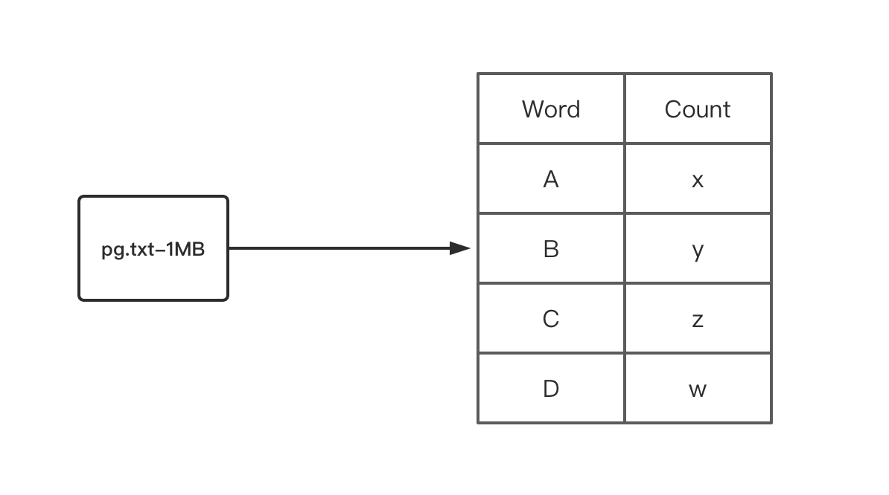
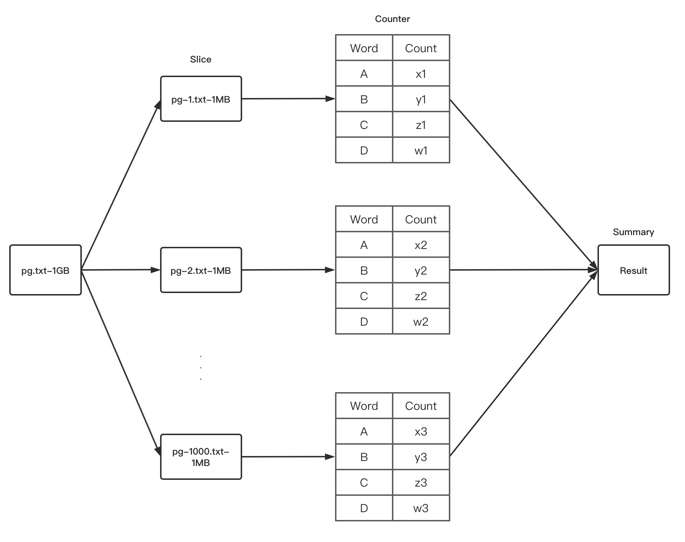
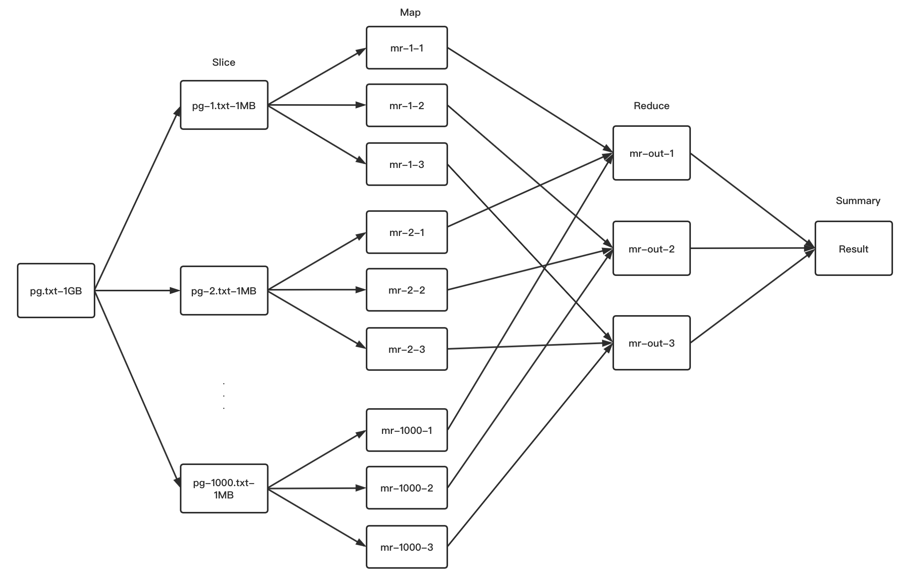
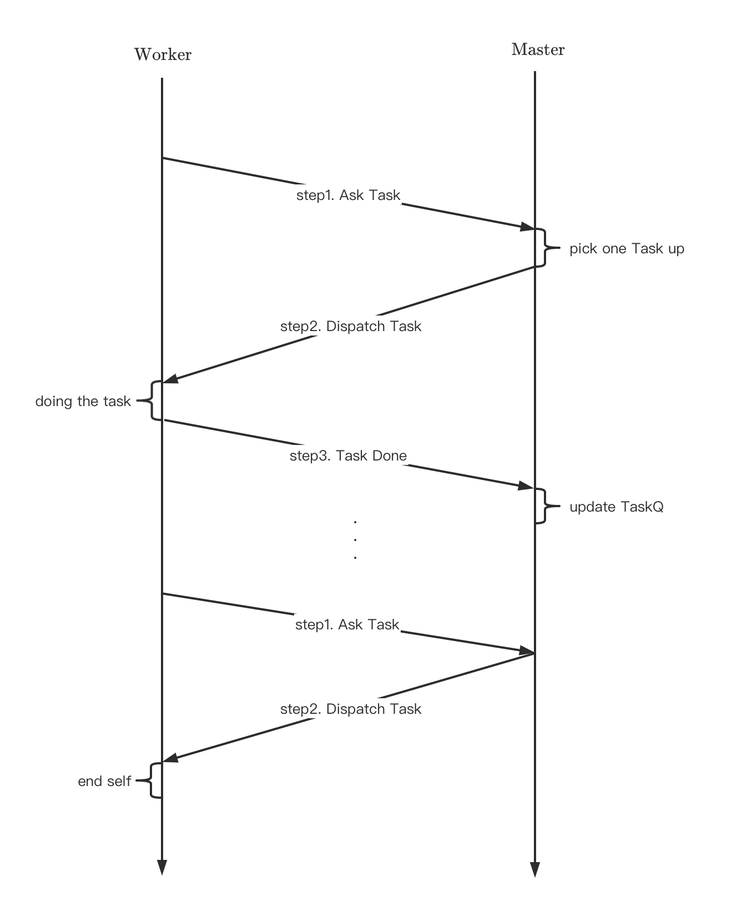
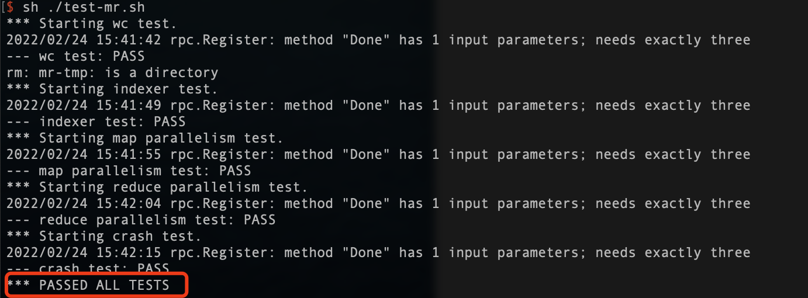

# Lab #1 - MapReduce

## What

+ Word Counter

  

+ 把单线程能完成的工作转换成用多线程完成，为什么？

  + 在单线程的情况下，统计1**MB**的.txt可能一眨眼的功夫就能完成；但如果是1**GB**的.txt，在单线程的情况下是需要等待一会的

+ 有没有一种可能使处理1**GB**像处理1**MB**文档一样快？

  + 将1**GB**的大文档切割成1000个1**MB**的小文档，然后将其分配给对应的1000个工作线程
  + 这些线程并发或并行处理，待1000个小文档全部处理完再进行合并，得到最后的Word Counter结果

  

  这方法当然行，但是还是不够快，没把分布式的特点发挥地淋漓尽致。

  + 我们考虑到在Counter阶段还可以再做些改进，比如分成两类`Task`分别为`MapTask`和`ReduceTask`
  + 处理`MapTask`的Worker只负责将出现的word打印出来，而不是去计数该word
  + 计数的工作让处理`ReduceTask`的Worker来做
  + 如此这般，简化了业务逻辑，利用分布式的特点实现了分工明确，类似流水线，能够大大提高产出效率

  

## Design

### Common

+ MapReduce的数据载体是`Task`，它分为两种：`MapTask`和`ReduceTask`

+ `Task`需要记录「文件名」「文件编号」和「总文件数量」
+ 除此之外，`MapTask`还需记录「Reduce数量」，`ReduceTask`还需要知道「分组的编号」

### Rpc

+ 在MapReduce中，`Task`的分配流程如下



只有在清楚需要传递哪些讯息之后，才能设计出满足需求的RPC

+ `AskTaskArgs`：对应「step1. Ask Task」，该rpc不要传达具体讯息，只需让Master知道该​Worker在请求`Task`即可
+ `TaskReply`：对应「step2. Dispatch Task」，该rpc需要包含`TaskType`和存放对应类型的`Task`队列
+ `TaskDoneArgs`：对应「step3. Task Done」，该rpc同`TaskReply`相似

### Master

+ Master需要有四个`TaskQueue`，用来管理`Task`。为什么是四个？
  + 多采用容器的思想，可以大大减少对于细节的研究
  + `mapTaskQ`和`reduceTaskQ`用来管理还未分配的`Task`
  + `mapRunningQ`和`reduceRunningQ`用来跟踪已被分配的`Task`
    + 为什么需要跟踪？因为领到该`Task`的Worker有可能会宕机，如果宕机了就会导致Master迟迟收不到`Processed Task`。对于Master而言缺少一个`Processed Task`就意味着整个Process失败，所以Master需要有一种机制能够检测出宕机，并找出对应的`Task`，将其重新提上日程，分配给别的「on-line」Worker

### Worker

+ Worker的流程很简单，要不就是在`Ask Task`，要不就是在`Working`。如果收到Master的终止信号，则结束进程

## Implementation

### Common

+ 首先定义`TaskType`的几种类型，用于信号识别

  ```go
  const (
  	TaskMap = 1
  	TaskReduce = 2
  	TaskWait = 3
  	TaskEnd = 4
  )
  ```

+ 随后定义`Task`

  ```go
  type MetaTask struct {
  	FileName string
  	FileIdx int
  	NFile int
  }
  
  type MapTask struct {
  	MetaTask
  	NReduce int
  }
  
  type ReduceTask struct {
  	MetaTask
  	PartIdx int
  }
  ```

### Rpc

+ 定义三种rpc

  ```go
  type AskTaskArgs struct {
  
  }
  
  type TaskDoneArgs struct {
  	TaskType int
  	MapTask MapTask
  	ReduceTasks []ReduceTask
  	Done bool
  }
  
  type TaskReply struct {
  	TaskType int
  	MapTask MapTask
  	ReduceTasks []ReduceTask
  }
  ```

### Master

+ 定义Master的结构

  ```go
  type Master struct {
  	// Your definitions here.
  	mtx sync.Mutex
  	mapTaskQ []MapTask
  	reduceTaskQ []ReduceTask
  	mapRunningQ []MapTask
  	reduceRunningQ []ReduceTask
  	nReduce int
  	done bool
  	isEndCh chan struct{}
  	mapRQTimer *time.Timer
  	reduceRQTimer *time.Timer
  }
  ```

  其中四个队列，上面讲过用途；还有`isEndCh`用于启动`disconnect`进程，两个`Timer`用来监视`RunningQ`

+ 入口函数

  ```go
  func MakeMaster(files []string, nReduce int) *Master {
  	m := Master{}
  
  	// Your code here.
  
  	/* ctor */
  	m.mapTaskQ = make([]MapTask, 0)
  	m.nReduce = nReduce
  	for idx, v := range files {
  		task := MapTask{
  			MetaTask: MetaTask{
  				FileName: v,
  				FileIdx: idx,
  				NFile: len(files),
  			},
  			NReduce: nReduce,
  		}
  		DPrintf("new MapTask..%v\n", task)
  		m.mapTaskQ = append(m.mapTaskQ, task)
  	}
  	/* disconnection */
  	m.done = false
  	m.isEndCh = make(chan struct{}, 1024)
  	/* back process to peek RunningQs */
  	m.mapRQTimer = time.NewTimer(2*FixedTimeOut*time.Second)
  	m.reduceRQTimer = time.NewTimer(2*FixedTimeOut*time.Second)
  
  	go m.isEnd()
  	go m.mapQHasRest()
  	go m.reduceQHasRest()
  
  	m.server()
  	return &m
  }
  ```

  在初始化好Master后又开了三个goroutine，主要就是监视作用

  ```go
  func (m *Master) isEnd() {
  	select {
  	case <-m.isEndCh:
  		DPrintf("wait other workers 2s\n")
  		time.Sleep(2*time.Second)
  		DPrintf("master close\n")
  		m.done = true
  		return
  	}
  }
  ```

  监视Master是否已经回收了所有的`Processed Task`，如果是则启动结束流程工作进程

  ```go
  func (m *Master)mapQHasRest() {
  	for {
  		select {
  		case <-m.mapRQTimer.C:
  			m.mtx.Lock()
  			if len(m.mapRunningQ) != 0 {
  				for idx, _ := range m.mapRunningQ {
  					m.mapTaskQ = append(m.mapTaskQ, m.mapRunningQ[idx])
  				}
  				m.mapRunningQ = []MapTask{}
  			}
  			m.mtx.Unlock()
  			m.mapRQTimer.Reset(FixedTimeOut*time.Second)
  			break
  		}
  	}
  }
  
  func (m *Master)reduceQHasRest() {
  	for {
  		select {
  		case <-m.reduceRQTimer.C:
  			m.mtx.Lock()
  			if len(m.reduceRunningQ) != 0 {
  				for idx, _ := range m.reduceRunningQ {
  					m.reduceTaskQ = append(m.reduceTaskQ, m.reduceRunningQ[idx])
  				}
  				m.reduceRunningQ = []ReduceTask{}
  			}
  			m.mtx.Unlock()
  			m.reduceRQTimer.Reset(FixedTimeOut*time.Second)
  			break
  		}
  	}
  }
  ```

  这两个函数相似，监视对应的`RunningQ`是否有迟迟未完成的`Task`，如果有则将`Task`重新打捞给`TaskQueue`。Ps. 迟迟未完成就意味着领走该`Task`的Worker宕机了

+ `AskTask()`

  ```go
  func (m *Master)AskTask(args *AskTaskArgs, reply *TaskReply) error {
  	m.mtx.Lock()
  	defer m.mtx.Unlock()
  
  	if len(m.mapTaskQ) > 0 {
  		task := m.mapTaskQ[0]
  		m.mapTaskQ = append(m.mapTaskQ[:0], m.mapTaskQ[1:]...)
  		m.mapRunningQ = append(m.mapRunningQ, task)
  
  		reply.TaskType = TaskMap
  		reply.MapTask = task
  		DPrintf("dispatch MapTask, fileName..%v, fileIdx..%v, nReduce..%v\n", task.FileName, task.FileIdx, task.NReduce)
  		return nil
  	}
  
  	if len(m.mapRunningQ) > 0 {
  		reply.TaskType = TaskWait
  		DPrintf("no MapTask can be dispatched\n")
  		return nil
  	}
  
  	if len(m.reduceTaskQ) > 0 {
  		partIdx := m.reduceTaskQ[0].PartIdx
  
  		for i:=0; i<len(m.reduceTaskQ); {
  			if m.reduceTaskQ[i].PartIdx == partIdx {
  				task := m.reduceTaskQ[i]
  
  				m.reduceRunningQ = append(m.reduceRunningQ, task)
  				reply.ReduceTasks = append(reply.ReduceTasks, task)
  				m.reduceTaskQ = append(m.reduceTaskQ[:i], m.reduceTaskQ[i+1:]...)
  				DPrintf("dispatch ReduceTask, fileName..%v, fileIdx..%v, partIdx..%v, nFile..%v\n", task.FileName, task.FileIdx, task.PartIdx, task.NFile)
  				continue
  			}
  			i++
  		}
  
  		reply.TaskType = TaskReduce
  		return nil
  	}
  
  	if len(m.reduceRunningQ) > 0 {
  		reply.TaskType = TaskWait
  		DPrintf("no ReduceTask can be dispatched\n")
  		return nil
  	}
  
  	reply.TaskType = TaskEnd
  	m.isEndCh <- struct{}{}
  	return nil
  }
  ```

  + 在分配`Task`时是优先分配`MapTask`的，只有在`MapTask`都处理好的情况下才会分配`ReduceTask`

+ `TaskDone()`

  ```go
  func (m *Master)TaskDone(args *TaskDoneArgs, reply *ExampleReply) error {
  	m.mtx.Lock()
  	defer m.mtx.Unlock()
  
  	if args.Done == true {
  		switch args.TaskType {
  		case TaskMap:
  			mapTask := args.MapTask
  			reduceTasks := args.ReduceTasks
  			DPrintf("MapTask done, fileName..%v, fileIdx..%v, nReduce..%v\n", mapTask.FileName, mapTask.FileIdx, mapTask.NReduce)
  
  			for i:=0; i<len(m.mapRunningQ); i++ {
  				if m.mapRunningQ[i].FileIdx == mapTask.FileIdx {
  					m.mapRunningQ = append(m.mapRunningQ[:i], m.mapRunningQ[i+1:]...)
  					break
  				}
  			}
  
  			for _, v := range reduceTasks {
  				m.reduceTaskQ = append(m.reduceTaskQ, v)
  				DPrintf("add ReduceTask, fileName..%v, fileIdx..%v, partIdx..%v, nFile..%v\n", v.FileName, v.FileIdx, v.PartIdx, v.NFile)
  			}
  			break
  		case TaskReduce:
  			tasks := args.ReduceTasks
  
  			for i:=0; i<len(tasks); i++ {
  				task := tasks[i]
  				DPrintf("ReduceTask done, fileName..%v, fileIdx..%v, partIdx..%v, nFile..%v\n", task.FileName, task.FileIdx, task.PartIdx, task.NFile)
  
  				for j:=0; j<len(m.reduceRunningQ); {
  					if m.reduceRunningQ[j].PartIdx == task.PartIdx {
  						m.reduceRunningQ = append(m.reduceRunningQ[:j], m.reduceRunningQ[j+1:]...)
  						continue
  					}
  					j++
  				}
  			}
  			break
  		default:
  			break
  		}
  	}
  
  	return nil
  }
  ```

  + 在Worker完成`Task`后需要根据`TaskType`类型进行相应处理
  + 一个`MapTask`在被处理后就会分裂成`nReduce`个`ReduceTask`，所以每个新`ReduceTask`需要用`partIdx`标记清楚
  + 而`ReduceTask`只需要到`RunningQ`中进行注销即可

### Worker

+ 入口函数

  ```go
  func Worker(mapf func(string, string) []KeyValue,
  	reducef func(string, []string) string) {
  
  	// Your worker implementation here.
  	for {
  		reply := CallAskTask()
  
  		switch reply.TaskType {
  		case TaskMap:
  			doMapTask(mapf, reply.MapTask)
  			break
  		case TaskReduce:
  			doReduceTask(reducef, reply.ReduceTasks)
  			break
  		case TaskWait:
  			time.Sleep(1*time.Second)
  			break
  		case TaskEnd:
  			return
  		default:
  			DPrintf("Unknown fault\n")
  			return
  		}
  	}
  
  	// uncomment to send the Example RPC to the master.
  	// CallExample()
  }
  ```

+ 两个rpc

  ```go
  func CallAskTask() TaskReply {
  	args := AskTaskArgs{}
  	reply := TaskReply{}
  
  	call("Master.AskTask", &args, &reply)
  
  	return reply
  }
  
  func CallTaskDone(taskType int, mapTask MapTask, reduceTasks []ReduceTask, done bool) {
  	args := TaskDoneArgs{
  		TaskType: taskType,
  		Done: done,
  		MapTask: mapTask,
  		ReduceTasks: reduceTasks,
  	}
  	reply := ExampleReply{}
  
  	call("Master.TaskDone", &args, &reply)
  }
  ```

+ 更多的就是业务逻辑的事

  ```go
  func doMapTask(mapf func(string, string) []KeyValue, task MapTask) {
  	DPrintf("doing MapTask, fileName..%v, fileIdx..%v, nReduce..%v\n", task.FileName, task.FileIdx, task.NReduce)
  	//time.Sleep(2*time.Second)		// slow for debug
  	time.Sleep(100*time.Millisecond)
  
  	/* read all context of pg-x.txt */
  	fileName := task.FileName
  	file, err := os.Open(fileName)
  	if err != nil {
  		log.Fatalf("cannot open %v", fileName)
  	}
  	content, err := ioutil.ReadAll(file)
  	if err != nil {
  		log.Fatalf("cannot read %v", fileName)
  	}
  	file.Close()
  
  	kvs := mapf(fileName, string(content))
  	sort.Sort(ByKey(kvs))
  
  	/* slices */
  	reduces := make([][]KeyValue, task.NReduce)
  	for _, kv := range kvs {
  		idx := ihash(kv.Key)%task.NReduce
  		reduces[idx] = append(reduces[idx], kv)
  	}
  
  	reduceTasks := []ReduceTask{}
  	for idx, reduce := range reduces {
  		reduceTask := ReduceTask{
  			MetaTask: task.MetaTask,
  			PartIdx: idx,
  		}
  		reduceTasks = append(reduceTasks, reduceTask)
  		DPrintf("split MapTask to ReduceTask, fileName..%v, fileIdx..%v, partIdx..%v\n", reduceTask.FileName, reduceTask.FileIdx, reduceTask.PartIdx)
  		output := "mr-" + strconv.Itoa(reduceTask.FileIdx) + "-" + strconv.Itoa(reduceTask.PartIdx) + ".csv"
  		file, _ = os.Create(output)
  
  		w := csv.NewWriter(file)
  		for _, v := range reduce {
  			w.Write([]string{v.Key, v.Value})
  		}
  		w.Flush()
  	}
  
  	CallTaskDone(TaskMap, task, reduceTasks, true)
  }
  
  func doReduceTask(reducef func(string, []string) string, tasks []ReduceTask) {
  	oname := "mr-out-" + strconv.Itoa(tasks[0].PartIdx)
  	ofile, _ := os.Create(oname)
  	defer ofile.Close()
  
  	kvs := []KeyValue{}
  
  	for _, v := range tasks {
  		DPrintf("doing ReduceTask, fileName..%v, fileIdx..%v, partIdx..%v, nFile..%v\n", v.FileName, v.FileIdx, v.PartIdx, v.NFile)
  
  		fileName := "mr-" + strconv.Itoa(v.FileIdx) + "-" + strconv.Itoa(v.PartIdx) + ".csv"
  		file, err := os.Open(fileName)
  		if err != nil {
  			log.Fatalf("cannot open %v", fileName)
  		}
  		defer file.Close()
  
  		r := csv.NewReader(file)
  		context, _ := r.ReadAll()
  		for _, u := range context {
  			kv := KeyValue{Key: u[0], Value: u[1]}
  			kvs = append(kvs, kv)
  		}
  	}
  	sort.Sort(ByKey(kvs))
  
  	i := 0
  	for i < len(kvs) {
  		j := i + 1
  		for j < len(kvs) && kvs[j].Key == kvs[i].Key {
  			j++
  		}
  		values := []string{}
  		for k := i; k < j; k++ {
  			values = append(values, kvs[k].Value)
  		}
  		output := reducef(kvs[i].Key, values)
  
  		fmt.Fprintf(ofile, "%v %v\n", kvs[i].Key, output)
  
  		i = j
  	}
  
  	//time.Sleep(2*time.Second)		// slow for debug
  	time.Sleep(100*time.Millisecond)
  
  	CallTaskDone(TaskReduce, MapTask{}, tasks, true)
  }
  ```

## Result



