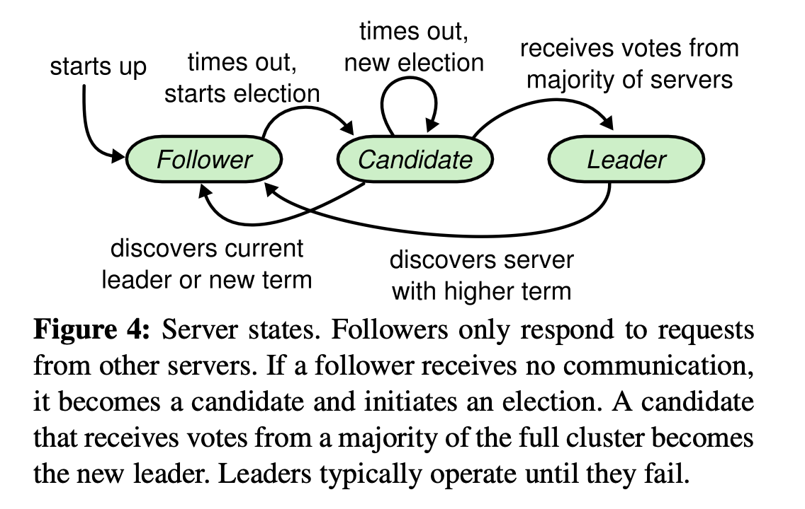
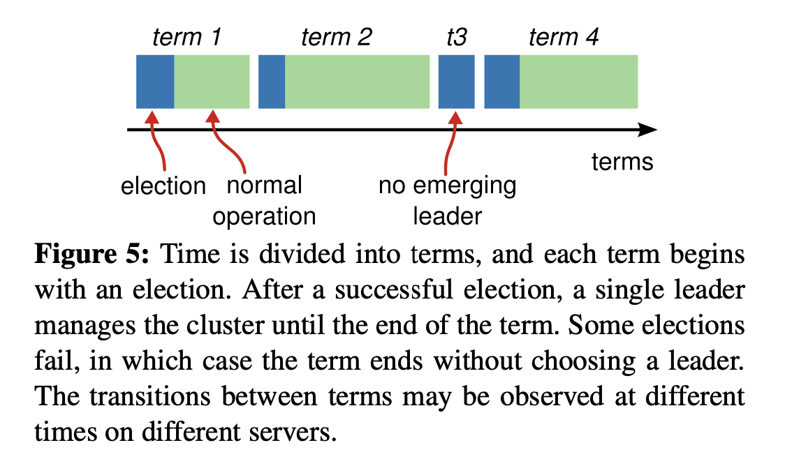
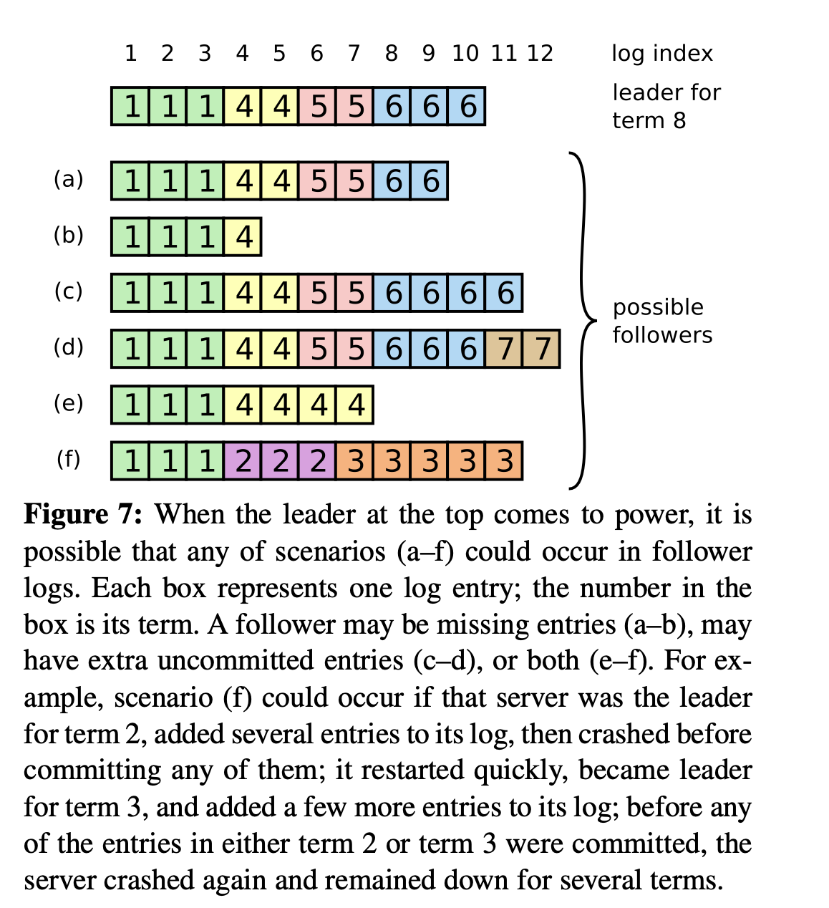
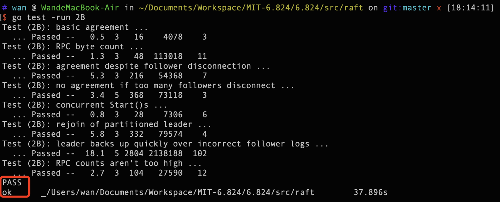
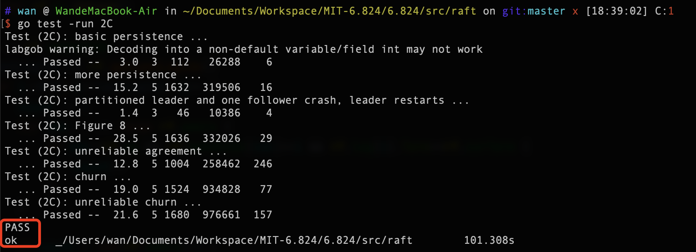

# Design

## 2A - Leader election

### 状态转换

Raft 节点只有三种状态

+  Follower 只有在 time out 之后才会变成 Candidate 
  +  Follower 在收到 `HeartBeat` 或者是投票给其他节点后老老实实地继续保持 Follower 状态
+ Candidate 随后发起选举，获得多数票后当选为 Leader 
  + 需要注意 Candidate 并不会因为没有收到多数票而回滚至 Follower ，它会等待下一轮 time out ，之后再发起选举
  +  Candidate 回滚至 Follower 只有一种情况，即 Candidate 收到了来自更高 `term` 的 Leader 发来的 `HeartBeat`
+  Leader 通过周期性地广播 `HeartBeat` 来维持自己在集群中的领导地位，即阻止其他节点发起投票选举



*P.s.* 

1.  `term` 在 Raft 中相当于逻辑时钟，它用来检测集群中是否有过期 Leader (*stale Leader*)，而且 `term` 是**单调递增**的

2. 在该 `term` 中选举出 Leader 后， Leader 就进入了服务 Client 的阶段，即 2B - Log replication ，该阶段会一直持续下去直到有新的投票选举发生

   

3. 每个 Raft 节点在一个 `term` 期间只有**一次**投票的机会

### Server 被动接收

Raft 节点在收到 `RequestVote Rpc` 后会检查：

1. 如果 Candidate 的 `term` 小于节点的 `term` ，则直接拒绝投票；

2. 如果大于，则更新自身的 `term` 并回滚至 Follower

   + 注意此时还需重置 `votedFor` ，因为更新自身 `term` 也就意味着发现了新的准 Leader ，集群即将在这个准 Leader 的带领下进入下一 `term` 阶段，该节点也有资格重新获得一张选票

3. 经过前面两个检查点后才到考虑是否该投票给 Candidate 的环节

   + 如果 Raft 节点手中还有票，并且 Candidate 的 `log` 还较新（详细见 [2B - Log replication]()），则投票给它；

   + 考虑到 [2C - Persistence](#2C - Persistence) 的问题， Raft 节点需要在每次修改 `votedFor` 后自动保存，以防宕机。试想一种情景：

     + 节点在 `term2` 投给 Candidate 后宕机了，随后节点快速重启，上线后依然处于`term2` 。由于 Candidate 并未获取大多数选票（只差一张，即 Candidate 并未收到该节点的 `Rpc` ）， Candidate 会再次向节点发送 `RequestVote` 。此时节点收到后会有记忆的投票给 Candidate ，随后 Candidate 顺利当选 Leader

     + 也就是论文中 Figure 2的 RequestVote RPC 里的条件2，原话是这样的，

       > If votedFor is **null** or **candidateId**, and candidate’s log is at least as up-to-date as receiver’s log, grant vote (§5.2, §5.4)

     + 还有一点，Raft 节点发送完 `Rpc` 后，如果在一定时间内没有收到反馈的话，会超时重发，原话是这样的，

       > Servers **retry** RPCs if they do not receive a response in a timely manner, and they issue RPCs in parallel for best performance.

### Candidate 主动审计

 Candidate 在接收到 `RequestVote Rpc` 回应后会检查：

1. 如果此时自己已经不再是 Candidate 了 或 `term` 已经更新过了，则判为无效 `Reply` ，直接放弃审计
2. 如果 `Reply.term` 大于 `term` ，说明集群中有更新的节点存在，则需要更新 `term` ，重置 `votedFor` 并回滚至 Follower 
3. 下面才是正式的审计阶段：
   + 如果 `Reply` 成功回应了，则唱票
   + 注意，在唱票的同时就要统计票数是否已过半，如果过半了立马变成 Leader 
   + 如果一轮拉票结束票数还未过半，则等待下一次 time out ，重新发起选举

### Leader 广播镇压

在 Candidate 选举成功成为合法 Leader 后：

+ 周期性地在集群中广播  ，只有这样才能阻止其他节点发起新的选举，才能保证 `term` 内集群成员关系的稳定，只有稳定才能进行 [2B - Log replication]()

当节点收到 Leader 发来的 `AppendEntries Rpc` 后：

+ 和 [Server 被动接收](#Server 被动接收) 如出一辙

当 Leader 收到回应后：

+ 和 [Candidate 主动审计](#Candidate 主动审计) 如出一辙

因为不考虑同步 `log` 的情况，所以上面的流程更为简单

*P.s.* 论文中提到 Raft 是如何避免选举冲突 §5.2

## 2B - Log replication

当 Leader 接受 Client 的请求后，首先会向集群广播 `AppendEntries Rpc` ，强制要求 Followers 保存新 `Entries` ，待过半 Follower 将新 `Entries` 本地化后才会 Leader 才会成功响应 Client 。待下一次 `AppendEntries Rpc` 时，Follower 得知 Leader 已将上次 `Entries` 提交，才会放心同步（提交），原话是这样的，

> Once a follower learns that a log entry is committed, it applies the entry to its local state machine (in log order)

这里要插一下，为什么在两个 Raft 节点的 `log` 中只要相同位置具有相同的 `term` 就能保证两个 `log` 是相同的？两个重要原则哦，原话是这样的，

> 1. If two entries in different logs have the same index and term, then they store the same command;
> 2. If two entries in different logs have the same index and term, then the logs are identical in all preceding entries

### Leader 广播 Entries

Leader 首先会更新自己的 `commitIndex` （Figure 2），主要是想确定上一个 `Entries` 是否已经被大多数 Follower 保存，如果已经被大多数所拥有，则 Leader 会提交 `Entries` ，即向 Client 反馈；

随后针对每个 Follower 的 `log` 同步情况进行较为精准的 `AppendEntries Rpc` 

### Follower 被动同步

Follower 在收到 `AppendEntries Rpc` 后会检查：

1. Leader 的 `term` 是否大于 自身的 `term` ，小于则直接拒绝；

2. 大于则会更新状态，和 [Server 被动接收](#Server 被动接收) 如出一辙

3. 然后才正式进入到同步 `log` 阶段：

   + 如果 Leader 发来的 `AE Rpc` 中 上条`Entry`的 `term` 和 节点 `log` 相同位置的 `term` 相同，则欣然接受。我翻译一下就是序号对上了，即你上次发的我已经全盘收下了，所以你这次发的我也能收下来，不会有错的，因为两次收发之间没有间隙

   + 如果不相同，则将冲突点后的所有 `Entries` 全部删除。这是因为 Raft 是强一致性的，Leader 会强迫 Follower 不惜一切手段与之同步；而且 `log` 的流向永远是 Leader 到 Follower，Follower 只配修改更新日志。原话是这样的，

     > In Raft, the leader handles inconsistencies by forcing the followers' logs to duplicate its own. This means that conflicting entries in follower logs will be overwritten with entries from the leader's log. A leader never overwrites or deletes entries in its own log

     

### Leader 主动审计

在回收 `AE Rpc` 时 Leader 会检查：

+ 如果 Follower 成功保存日志，则会更新对应的 `nextIndex` 和 `matchIndex` ；如果失败，则向 Follower 发送更久之前的 `Entries`

这里需要主要 `nextIndex` 作用很明确，就是记录下次该给 Follower 发送多久之前的 `Entries`；而 `matchIndex` 是用来告诉 Leader ， 该 Follower 本地化了多少 `Entries`。只有 Leader 确切知道了过半 Follower 都已经保存了那一时间段的 `Entries` ，它才会放心地提交

### 选举限制

在 [2A - Leader election](#2A - Leader election) 中提到，选举 Leader 不仅仅是看 `term` ，还需要看 `log` 的新旧程度（*up-to-date*）

**Up-to-date** 是这样定义的：

>If the logs have last entries with different terms, then the log with the later term is more up-to-date. 
>
>If the logs end with the same term, then whichever log is longer is more up-to-date.

## 2C - Persistence

因为 Raft 需要保证 *Safety* ，也就是说集群在运行中要接受部分节点可能会宕机的事实。宕机不可怕，可怕的是没有做好备份

Raft 的备份是保存三个东西就足以，`current term` 、 `votedFor` 以及 `log` ，其中 `current term` 和 `votedFor` 尤其重要，这是保证一个重要原则：一个 `term` 一张选票，如果破坏了这个原则，那么就会在一个 `term` 出现多个 Leader 的可怕局面

以及 Raft 使用投票机制来阻止 Candidate 的 `log` 中还有未提交的 `Entries` 当选为 Leader 的情况发生，说的比较拗口，原话是这样的，

> Raft uses the voting process to prevent a candidate from winning an election unless its log contains all committed entries. 

P.s. 脑裂也会在多人选票机制中被克服，即使网络会分区，两个分区中的 Leader 的 `term` 也不会相同。这是由 Election restriction 保证的，一个节点能当选为 Leader ，势必获得了过半选票，反过来想，不存在一种情况，Leader A在 `term 2` 中获得过半选票， Leader B在 `term 2` 中也获得过半选票，前提是节点数为奇数！他们势必是一个 `term 2` ，一个 `term 3`

# Implementation

Raft 的主流程，我分模块coding，自认为写的较为简洁，无太多注释，相信反而更为清晰明了

```go
package raft

//
// this is an outline of the API that raft must expose to
// the service (or tester). see comments below for
// each of these functions for more details.
//
// rf = Make(...)
//   create a new Raft server.
// rf.Start(command interface{}) (index, term, isleader)
//   start agreement on a new log entry
// rf.GetState() (term, isLeader)
//   ask a Raft for its current term, and whether it thinks it is leader
// ApplyMsg
//   each time a new entry is committed to the log, each Raft peer
//   should send an ApplyMsg to the service (or tester)
//   in the same server.
//

import (
	"bytes"
	//"labgob"
	"sync"
	"time"
)
import "sync/atomic"
import "../labrpc"

// import "bytes"
import "../labgob"


//
// as each Raft peer becomes aware that successive log entries are
// committed, the peer should send an ApplyMsg to the service (or
// tester) on the same server, via the applyCh passed to Make(). set
// CommandValid to true to indicate that the ApplyMsg contains a newly
// committed log entry.
//
// in Lab 3 you'll want to send other kinds of messages (e.g.,
// snapshots) on the applyCh; at that point you can add fields to
// ApplyMsg, but set CommandValid to false for these other uses.
//
type ApplyMsg struct {
	CommandValid bool
	Command      interface{}
	CommandIndex int
}

//
// A Go object implementing a single Raft peer.
//
type Raft struct {
	mu        sync.Mutex          // Lock to protect shared access to this peer's state
	peers     []*labrpc.ClientEnd // RPC end points of all peers
	persister *Persister          // Object to hold this peer's persisted state
	me        int                 // this peer's index into peers[]
	dead      int32               // set by Kill()

	// Your data here (2A, 2B, 2C).
	// Look at the paper's Figure 2 for a description of what
	// state a Raft server must maintain.
	role Role		// helper
	voteCount int 	// helper

	/* persistent state on all servers */
	curTerm int
	votedFor int
	log []LogEntry

	/* volatile state on all servers */
	commitIdx int
	lastApplied int

	/* volatile state on leaders */
	nextIdx []int
	matchIdx []int

	applyCh chan ApplyMsg

	/* some chans for notification */
	grantVoteCh chan struct{}
	heartBeatCh chan struct{}
	beLeaderCh chan struct{}
	toCommitCh chan struct{}
}

func newRaft(peers []*labrpc.ClientEnd, me int, persister *Persister, applyCh chan ApplyMsg) *Raft {
	rf := &Raft{
		peers : peers,
		persister: persister,
		me: me,
		role: Follower,
		voteCount: 0,
		curTerm: 0,
		votedFor: NoBody,
		log: make([]LogEntry, 0),
		commitIdx: 0,
		lastApplied: 0,
		grantVoteCh: make(chan struct{}, ChanCap),
		heartBeatCh: make(chan struct{}, ChanCap),
		beLeaderCh: make(chan struct{}, ChanCap),
		toCommitCh: make(chan struct{}, ChanCap),
		applyCh: applyCh,
	}
	rf.log = append(rf.log, LogEntry{Term: 0})

	return rf
}

// return currentTerm and whether this server
// believes it is the leader.
func (rf *Raft) GetState() (int, bool) {
	// Your code here (2A).
	return rf.curTerm, rf.isLeader()
}

//
// save Raft's persistent state to stable storage,
// where it can later be retrieved after a crash and restart.
// see paper's Figure 2 for a description of what should be persistent.
//
func (rf *Raft) persist() {
	// Your code here (2C).
	// Example:
	// w := new(bytes.Buffer)
	// e := labgob.NewEncoder(w)
	// e.Encode(rf.xxx)
	// e.Encode(rf.yyy)
	// data := w.Bytes()
	// rf.persister.SaveRaftState(data)

	w := new(bytes.Buffer)
	e := labgob.NewEncoder(w)

	e.Encode(rf.curTerm)
	e.Encode(rf.votedFor)
	e.Encode(rf.log)

	data := w.Bytes()
	rf.persister.SaveRaftState(data)
}


//
// restore previously persisted state.
//
func (rf *Raft) readPersist(data []byte) {
	if data == nil || len(data) < 1 { // bootstrap without any state?
		return
	}
	// Your code here (2C).
	// Example:
	// r := bytes.NewBuffer(data)
	// d := labgob.NewDecoder(r)
	// var xxx
	// var yyy
	// if d.Decode(&xxx) != nil ||
	//    d.Decode(&yyy) != nil {
	//   error...
	// } else {
	//   rf.xxx = xxx
	//   rf.yyy = yyy
	// }

	r := bytes.NewBuffer(data)
	d := labgob.NewDecoder(r)

	d.Decode(&rf.curTerm)
	d.Decode(&rf.votedFor)
	d.Decode(&rf.log)
}

//
// the service using Raft (e.g. a k/v server) wants to start
// agreement on the next command to be appended to Raft's log. if this
// server isn't the leader, returns false. otherwise start the
// agreement and return immediately. there is no guarantee that this
// command will ever be committed to the Raft log, since the leader
// may fail or lose an election. even if the Raft instance has been killed,
// this function should return gracefully.
//
// the first return value is the index that the command will appear at
// if it's ever committed. the second return value is the current
// term. the third return value is true if this server believes it is
// the leader.
//
func (rf *Raft) Start(command interface{}) (int, int, bool) {
	rf.mu.Lock()
	defer rf.mu.Unlock()

	index := -1
	term := rf.curTerm
	isLeader := rf.isLeader()

	// Your code here (2B).
	if isLeader {
		rf.log = append(rf.log, LogEntry{Term: term, Command: command})
		index = rf.getLastLogIdx()
		rf.persist()
		DPrintf("add cmd %v, idx..%v server %v\n", command, index, rf.me)
	}

	return index, term, isLeader
}

//
// the tester doesn't halt goroutines created by Raft after each test,
// but it does call the Kill() method. your code can use killed() to
// check whether Kill() has been called. the use of atomic avoids the
// need for a lock.
//
// the issue is that long-running goroutines use memory and may chew
// up CPU time, perhaps causing later tests to fail and generating
// confusing debug output. any goroutine with a long-running loop
// should call killed() to check whether it should stop.
//
func (rf *Raft) Kill() {
	atomic.StoreInt32(&rf.dead, 1)
	// Your code here, if desired.
}

func (rf *Raft) killed() bool {
	z := atomic.LoadInt32(&rf.dead)
	return z == 1
}

func (rf *Raft) prepTobeCandidate() {
	rf.mu.Lock()
	defer rf.mu.Unlock()

	rf.curTerm++
	rf.votedFor = rf.me
	rf.voteCount = 1
	rf.persist()
}

func (rf *Raft) prepTobeLeader() {
	rf.mu.Lock()
	defer rf.mu.Unlock()

	rf.role = Leader
	rf.nextIdx = make([]int, len(rf.peers))
	rf.matchIdx = make([]int, len(rf.peers))

	for i, _ := range rf.peers {
		rf.nextIdx[i] = rf.getLastLogIdx()+1
		rf.matchIdx[i] = 0
	}
}

func (rf *Raft) broadcastRV() {
	rf.mu.Lock()
	defer rf.mu.Unlock()

	for i, _ := range rf.peers {
		if i!=rf.me && rf.role==Candidate {
			go func(id int) {
				args := RequestVoteArgs{
					Term: rf.curTerm,
					CandidateId: rf.me,
					LastLogIdx: rf.getLastLogIdx(),
					LastLogTerm: rf.getLastLogTerm(),
				}
				reply := RequestVoteReply{}

				rf.sendRequestVote(id, &args, &reply)
			}(i)
		}
	}
}

func (rf *Raft) broadcastAE() {
	rf.mu.Lock()
	defer rf.mu.Unlock()

	N := rf.commitIdx
	lastLogIdx := rf.getLastLogIdx()
	for i:=N+1; i<=lastLogIdx; i++ {
		count := 1
		for idx, _ := range rf.peers {
			if idx!=rf.me && rf.matchIdx[idx]>=i && rf.log[i].Term==rf.curTerm {
				count++
			}
		}

		if count > len(rf.peers)/2 {
			N = i
			break
		}
	}

	if N > rf.commitIdx {
		rf.commitIdx = N
		rf.toCommitCh <- struct{}{}
	}

	for i, _ := range rf.peers {
		if i!=rf.me && rf.role==Leader {
			go func(id int) {
				args := AppendEntriesArgs{
					Term: rf.curTerm,
					LeaderId: rf.me,
					PrevLogIdx: rf.nextIdx[id]-1,
					LeaderCommit: rf.commitIdx,
				}
				args.PrevLogTerm = rf.log[args.PrevLogIdx].Term
				args.Entries = rf.log[rf.nextIdx[id]:]

				reply := AppendEntriesReply{}

				rf.sendAppendEntries(id, &args, &reply)
			}(i)
		}
	}
}

func (rf *Raft) run() {
	for !rf.killed() {
		switch rf.role {
		case Follower:
			select {
			case <-rf.grantVoteCh:
			case <-rf.heartBeatCh:
			case <-time.After(randElectionTimeOut()):
				rf.role = Candidate
			}
			break
		case Candidate:
			rf.prepTobeCandidate()
			go rf.broadcastRV()
			select {
			case <-time.After(randElectionTimeOut()):
			case <-rf.heartBeatCh:
				rf.role = Follower
			case <-rf.beLeaderCh:
				rf.prepTobeLeader()
			}
			break
		case Leader:
			rf.broadcastAE()
			time.Sleep(fixedHeartBeatTimeOut())
			break
		}
	}
}

func (rf *Raft) commit() {
	for !rf.killed() {
		select {
		case <-rf.toCommitCh:
			rf.mu.Lock()

			commitIdx := rf.commitIdx
			DPrintf("commit in server %v, lastApplied..%v, commitIdx..%v ", rf.me, rf.lastApplied, commitIdx)
			for i:=rf.lastApplied+1; i<=commitIdx; i++ {
				msg := ApplyMsg{CommandIndex: i, CommandValid: true, Command: rf.log[i].Command}
				rf.applyCh <- msg
				DPrintf("%v", msg)
			}
			rf.lastApplied = commitIdx

			rf.mu.Unlock()
		}
	}
}

//
// the service or tester wants to create a Raft server. the ports
// of all the Raft servers (including this one) are in peers[]. this
// server's port is peers[me]. all the servers' peers[] arrays
// have the same order. persister is a place for this server to
// save its persistent state, and also initially holds the most
// recent saved state, if any. applyCh is a channel on which the
// tester or service expects Raft to send ApplyMsg messages.
// Make() must return quickly, so it should start goroutines
// for any long-running work.
//
func Make(peers []*labrpc.ClientEnd, me int,
	persister *Persister, applyCh chan ApplyMsg) *Raft {

	// Your initialization code here (2A, 2B, 2C).
	rf := newRaft(peers, me, persister, applyCh)

	// initialize from state persisted before a crash
	rf.readPersist(persister.ReadRaftState())

	go rf.run()

	go rf.commit()

	return rf
}
```

RequestVote 部分，

```go
package raft

//
// example RequestVote RPC arguments structure.
// field names must start with capital letters!
//
type RequestVoteArgs struct {
	// Your data here (2A, 2B).
	Term int
	CandidateId int
	LastLogIdx int
	LastLogTerm int
}

//
// example RequestVote RPC reply structure.
// field names must start with capital letters!
//
type RequestVoteReply struct {
	// Your data here (2A).
	Term int
	VoteGranted bool
}

//
// example RequestVote RPC handler.
//
func (rf *Raft) RequestVote(args *RequestVoteArgs, reply *RequestVoteReply) {
	// Your code here (2A, 2B).
	rf.mu.Lock()
	defer rf.mu.Unlock()
	defer rf.persist()

	reply.VoteGranted = false
	if args.Term < rf.curTerm {
		reply.Term = rf.curTerm
		return
	}

	if args.Term > rf.curTerm {
		rf.curTerm = args.Term
		rf.role = Follower
		rf.votedFor = NoBody
	}
	reply.Term = rf.curTerm

	term := rf.getLastLogTerm()
	idx := rf.getLastLogIdx()
	upToDate := false

	if args.LastLogTerm > term {
		upToDate = true
	}

	if args.LastLogTerm==term && args.LastLogIdx>=idx {
		upToDate = true
	}

	if (rf.votedFor==NoBody || rf.votedFor==args.CandidateId) && upToDate {
		rf.role = Follower
		rf.votedFor = args.CandidateId
		reply.VoteGranted = true
		rf.grantVoteCh <- struct{}{}
	}
}

//
// example code to send a RequestVote RPC to a server.
// server is the index of the target server in rf.peers[].
// expects RPC arguments in args.
// fills in *reply with RPC reply, so caller should
// pass &reply.
// the types of the args and reply passed to Call() must be
// the same as the types of the arguments declared in the
// handler function (including whether they are pointers).
//
// The labrpc package simulates a lossy network, in which servers
// may be unreachable, and in which requests and replies may be lost.
// Call() sends a request and waits for a reply. If a reply arrives
// within a timeout interval, Call() returns true; otherwise
// Call() returns false. Thus Call() may not return for a while.
// A false return can be caused by a dead server, a live server that
// can't be reached, a lost request, or a lost reply.
//
// Call() is guaranteed to return (perhaps after a delay) *except* if the
// handler function on the server side does not return.  Thus there
// is no need to implement your own timeouts around Call().
//
// look at the comments in ../labrpc/labrpc.go for more details.
//
// if you're having trouble getting RPC to work, check that you've
// capitalized all field names in structs passed over RPC, and
// that the caller passes the address of the reply struct with &, not
// the struct itself.
//
func (rf *Raft) sendRequestVote(server int, args *RequestVoteArgs, reply *RequestVoteReply) bool {
	ok := rf.peers[server].Call("Raft.RequestVote", args, reply)

	rf.mu.Lock()
	defer rf.mu.Unlock()

	if ok {
		term := rf.curTerm

		if rf.role!=Candidate || args.Term!=term {
			return ok
		}

		if reply.Term > term {
			rf.curTerm = reply.Term
			rf.role = Follower
			rf.votedFor = NoBody
			rf.persist()
			return ok
		}

		if reply.VoteGranted {
			rf.voteCount++
			if rf.voteCount > len(rf.peers)/2 {
				rf.beLeaderCh <- struct{}{}
			}
		}
	}

	return ok
}
```

AppendEntries部分，

```go
package raft

type AppendEntriesArgs struct {
	Term int
	LeaderId int
	PrevLogIdx int
	PrevLogTerm int
	Entries []LogEntry
	LeaderCommit int
}

type AppendEntriesReply struct {
	Term int
	Success bool
}

func (rf *Raft) AppendEntries(args *AppendEntriesArgs, reply *AppendEntriesReply) {
	// Your code here (2A, 2B).
	rf.mu.Lock()
	defer rf.mu.Unlock()
	defer rf.persist()

	reply.Success = false
	if args.Term < rf.curTerm {
		reply.Term = rf.curTerm
		return
	}

	rf.heartBeatCh <- struct{}{}
	if args.Term > rf.curTerm {
		rf.curTerm = args.Term
		rf.role = Follower
		rf.votedFor = NoBody
	}
	reply.Term = rf.curTerm

	lastLogIdx := rf.getLastLogIdx()
	if lastLogIdx>=args.PrevLogIdx {
		if rf.log[args.PrevLogIdx].Term == args.PrevLogTerm {
			rf.log = append(rf.log[:args.PrevLogIdx+1], args.Entries...)
			reply.Success = true

			if args.LeaderCommit > rf.commitIdx {
				lastLogIdx = rf.getLastLogIdx()
				if args.LeaderCommit > lastLogIdx {
					rf.commitIdx = lastLogIdx
				} else {
					rf.commitIdx = args.LeaderCommit
				}
				rf.toCommitCh <- struct{}{}
			}
		} else {
			rf.log = append(rf.log[:args.PrevLogIdx], args.Entries...)
		}
	}
}

func (rf *Raft) sendAppendEntries(server int, args *AppendEntriesArgs, reply *AppendEntriesReply) bool {
	ok := rf.peers[server].Call("Raft.AppendEntries", args, reply)

	rf.mu.Lock()
	defer rf.mu.Unlock()

	if ok {
		term := rf.curTerm

		if rf.role!=Leader || args.Term!=term {
			return ok
		}

		if reply.Term > term {
			rf.curTerm = reply.Term
			rf.role = Follower
			rf.votedFor = NoBody
			rf.persist()
			return ok
		}

		if reply.Success {
			rf.nextIdx[server] += len(args.Entries)
			rf.matchIdx[server] = rf.nextIdx[server]-1
		} else {
			rf.nextIdx[server]--
		}
	}

	return ok
}
```

以及我自己定义的一些结构体和功能函数，这些不重要

```go
package raft

import (
	"math/rand"
	"time"
)

type Role int

const (
	Follower = 0
	Candidate = 1
	Leader = 2
)

func (rf *Raft) isLeader() bool {
	return rf.role == Leader
}

const (
	NoBody = -1
)

type LogEntry struct {
	Term int
	Command interface{}
}

func (rf *Raft) getLastLogIdx() int {
	return len(rf.log)-1
}

func (rf *Raft) getLastLogTerm() int {
	return rf.log[len(rf.log)-1].Term
}

const (
	ChanCap = 100
)

const (
	ElectionTimeOut = time.Millisecond*150
	HeartBeatTimeOut = time.Millisecond*50
)

// generate electionTimeOut about 150ms~300ms
func randElectionTimeOut() time.Duration {
	r := rand.New(rand.NewSource(time.Now().UnixNano()))
	t := time.Duration(r.Int63()) % ElectionTimeOut
	return ElectionTimeOut+t
}

// heartBeat gap about 100ms
func fixedHeartBeatTimeOut() time.Duration {
	return HeartBeatTimeOut
}
```

# Result





